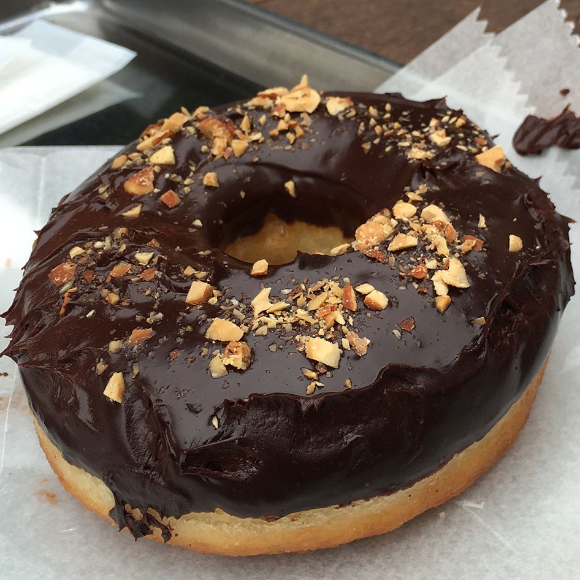

## Introduction
This is my on-going list of the best donuts in the world. What I'm looking for in a great donut: a warm moist cake (or yeast-based dough), with a firm hard outer crunch when biting into it. The icing and toppings should complement the donut, not be the star of the show. No cream or fruit filling (that's for pastries). A well cooked plain donut can beat a regular donut with a bunch of fancy cereal or candy toppings. Given these criteria a made-to-order restaurant donut has a huge advantage over local pink-box donut store. And it should. If you've never had a made to order donut, it will almost certainly change your perspective on what makes a great donut.

## 1. Two Sparrows Maple Bacon
#### Chicago, IL _closed_

	
	
	

The bacon maple donut at 2 Sparrows is the bar with which I use to measure all other food. I've had 3 maple bacon donuts on two separate trips to Chicago (along with their cookies & cream donut on the second trip) and each time it was phenomenal. It's what I have come to expect from a perfect cake donut with the outside crunchy enough that you can you can use a knife to slice through it without smashing the donut itself. The maple glaze was sweet, but very thin adding a lot of flavor without being a thick frosting overwhelming the perfectly cooked donut. 

As I mentioned earlier, I went to 2 Sparrows on two separate trips. Despite building it up in my head in the year between visits, it exceeded expectations on the second visit. I was extremely disappointed when I found out they had closed, had I known in advance I would have made sure to fly out again from California. The world is not right when the best of all donuts can no longer be had.

Lastly, since Keith Law introduced me to 2 Sparrows (via Twitter), I'll leave with this his quote from [Chicago Eats](http://meadowparty.com/blog/2012/08/21/chicago-eats-2/): 
>2 Sparrows‘ maple bacon donut, which is on the short list of the best things I’ve ever eaten, not just for the bacon, but for the absolutely perfect donut at the heart of the $4 dish. The maple glaze is very sweet, like pure maple sugar, so the donut beneath it has little to no sweetness of its own, instead shining for the crispy exterior and a soft, light interior. The bacon crumbled over the top is house-cured, with the salt well balanced with the glaze’s sweetness, and some texture contrast with the soft donut. I admit the plate seemed a little gimmicky, but the execution across the board is tremendous.

## 2. Gordough's
#### Austin, TX | <a href="http://gourdoughs.com/" target="_blank">gourdoughs.com</a>
Gordough's in Austin, TX has a wide array of donuts with various icings and toppings. From classic icings, as well as cream cheese and honey. While toppings included combinations fruit, candy, cheese, or even fried chicken tenders. Most importantly Gordough's donuts (and toppings) were made fresh as you ordered. 

A small, metal food truck in the hot Texas sun, Gordough's is certainly worth a visit. While many of the toppings can be extreme or even overpowering for some, underneath the crazy toppings is a fresh, fantasticly cooked donut. 

 * 

	

**Cinnamon and Sugar** — One of the simpler items on the menu, the cinnamon and sugar donut is a yeast-based donut, lighter and airier than a cake donut, like the 2 Sparrows maple bacon. While not as creative as some other menu items, the simplicity highlighted the dough fried to perfection. When I became overwhelmedby some of the other flavor-rich concoctions, the cinnamon sugar is where I would return.
 * 

	

**Maple Bacon** — The bacon maple at Gordoughs was an excellent donut, but took second place. Along with the donut, the bacon is cooked fresh when ordered. The maple glaze was thin, but layer on a little thick for my taste (I ordered light maple on the second trip). While all the ingredients were great tasting, crispy bacon bits instead of full-sized strips would've been easier to eat outside with plastic silverware. All-in-all a fantastic, delicious donut, but not quite the 2 Sparrows.
 * 

	

**Cream Cheese Heath Bar** — This was a rich cake donut with a generous amount of heath bar chunks. I expected to be overwhelmed by the sweetness, but the layer of cream cheese in-between was not sweetened, making a fantastic companion to the sweet and crunchy Heath bar chunks. 

 [See the full post soon!](../TODO).

## 3. Blue Star
#### Tokyo, Japan | <a href="http://www.bluestardonuts.com/" target="_blank">bluestardonuts.com</a>

	
	

We visited the Tokyo location for Blue Star Donuts. While Blue Star originated in Portland (and is now in Los Angeles), we decided the Tokyo location would be authentic enough after [learning "Micah Camden was humbled by Japanese bakers"](https://www.pdxmonthly.com/articles/2015/4/24/3-things-i-learned-opening-a-pdx-doughnut-shop-in-japan). As usual I couldn't decide what to get, so I opted for three donuts: Chocolate, Glazed, and Chestnut/Hazelnut (I’m not sure which). My wife got two: Green Tea (she had seen online) and a raspberry chocolate (which had pink icing with what looked like gold sparkles on it). My brother got a pumpkin donut with pumpkin cream filling (see above for my thoughts on filling ಠ_ಠ).

	
	

In the end the _Chestnut Shiso Cake_ donut (that I almost didn't get turned out to be the best). While it's incredibly difficult for pre-made donuts to compete with made-to-order, the Blue Star Chestnut Shiso Cake managed to do just that.  It was amazing. As I bit into it there was a great crunch, it had the almost crispy outside that you want in a cake donut, while the inside remained incredibly warm, soft, and most importantly, moist. Exactly what you want in great cake donut and this Blue Star executed it perfectly. I was sold on the first bite. The icing on the chestnut was pretty good, spread on a little thick for my preference, but it didn't have an overpowering flavor, so the thickish layer didn’t overpower the glorious cake. In addition there were some shavings on the icing, which was a nice, unique touch.

For details on the two lesser donuts, [see the full post](../TODO).

UPDATE: Apparently the Tokyo location has now closed, but Blue Star is still alive and well in Portland and Southern California.

## 4. The Wipeout (Anuenue Cafe)
#### Poipu, Kauai, HI | <a href="http://www.anuenuecafe.com/menu.html" target="_blank">anuenuecafe.com</a>

	

I'm not sure where I first heard of this place, but we had been searching for a Kauai breakfast place the whole trip. This was a bit of a drive across the island on one of our last mornings, so we made the trek over. The kalua pork benedict was what had initial drawn me in (which was fantastic in it's own right), but on our arrival I saw the made-to-order donut with macadamia nots topped with vanilla ice cream! Like the other made-to-order donuts on the list, it had a good crunch and a soft warm inside that you usually only get when made-to-order. The donut itself was plain, allowing the chocolate, macadamia nuts, and ice cream to provide the majority of the flavor. The four different textures provided by the ice cream, chocolate, roasted nuts, and mouth-watering donuts made for a great combination. I ordered one for the table, then, unsatisfied after it quickly disapperaed, I went back and ordered another for myself. Ultimately, the sweet-on-sweet-on-sweet flavor ranked slightly below the other entries on the list, with a little more flavor-depth, but make no mistake this is one of the best donuts you'll ever have. It was a fantastsic breakfast spot (even the non-donut dishes) that I would highly recommend to anybody visiting Kauai.

## 5. The Doughnut Valut
#### Chicago, IL | <a href="http://doughnutvault.com/" target="_blank">doughnutvault.com</a>

	

Rounding out the top 5 is The Doughnut Vault. I visited this place after my first ever 2 Sparrows maple-bacon (and a full breakfast), despite my full stomach The Doughnut Valut still made an impression. Like a good barbecue joint, The Doughnut Valut is a little hole in the wall open until they sell out of food (usually in the late-morning/early afternoon). When we arrived in the late morning, numerous flavors had already been sold out. Lucky for me they still had a few of their specialty: glaed buttermilk old-fashioneds. Glistening with the perfect amount of glaze, with each bite the moist cake center melts in your mouth unlike any donut with that density. Easily the best old-fashoined I've had, the right amount of glaze and dough that wasn't too heavy, even after a full breakfast. If you are a fan of old-fashioned donuts you can't do better than The Doughnut Vault.

It's been several years since I've been here, on my next visit to Chicago I hope to go early to try a few of the flavors that sold out.

## Honorable Mentions
### Pam's Donuts
#### Temecula, CA
The donuts I have the most often (although less now that I'm old, fat, and have way more co-workers to feed). The best donut shop in the neighborhood and one of the best pink-box donut shops around.

### AMA Donuts
#### Covina, CA
Probably started my donut craze. The donut shop between my house and day-care. I ordered chocolate with nuts, glazed twist, and a chocolate milk every Friday. Growing up we tried plenty of other donut shops nearby, but none compared to AMA. Looking back I think they had the crunch down better than anybody else. 

### Top Pot Donuts
#### Seattle, WA | <a href="http://www.toppotdoughnuts.com/" target="_blank">toppotdoughnuts.com</a>

	
	

A fairly well known donut place in Seattle. Unlike most donut spots, this was a huge place with plenty of seating. Great place to grab a coffee, a donut or two (or three). While the chocolate with sprinkles (my typical go-to) didn't blow me away, the old fashioned donuts were great. Particularly the chocolate glazed—typical old-fashoined shape and texture, with slightly lighter dough than a typical old fashoined. The glaze on top of the chocolate cake was is a nice twist on the typical old-fashioned. Easily the second-best old-fashioned I've had (next to Doughnut Valut). I'd consider this a must-stop if you're in the Seattle area.

### PrepKitchen
#### DelMar, CA | <a href="http://prepkitchendelmar.com/" target="_blank">prepkitchendelmar.com</a>

	

While not a donut shop, they had an appetizer Ricotta Donut Holes with Vanilla Bean and Orange Sugar. Made-to-order (how can I resist). The hint of orange in the sugar was a delighful, unique flavor, hopefully they continue to create donut concoctions in the future.

### Manuela Malasada Co
#### Big Island, HI | <a href="http://www.bigislandmalasadas.com/" target="_blank">bigislandmalasadas.com</a>

	

This is a little truck off the road. These are more like large donut-holes, which can be customized and are made-to-order. After driving around looking for the truck we finally found it. Donuts are simple and cooked well. Varoius types sugary toppings (and fillings, if you're into that). One of the local sugars was He-Lei, a sweet-and-sour plum sauce, which was a very unique (and tasty) flavor.

### Holy Donuts
#### Kona, HI

	

This is one of the more common places that makes a fairly common donut and adds all sorts of creative topping combinations (candies, cereals, etc). There were some pretty good combinations (Salted Caramel Macadamia Nut being my favorite), but nothing ground-breaking. More notably, they provide donuts to the local homeless population. 